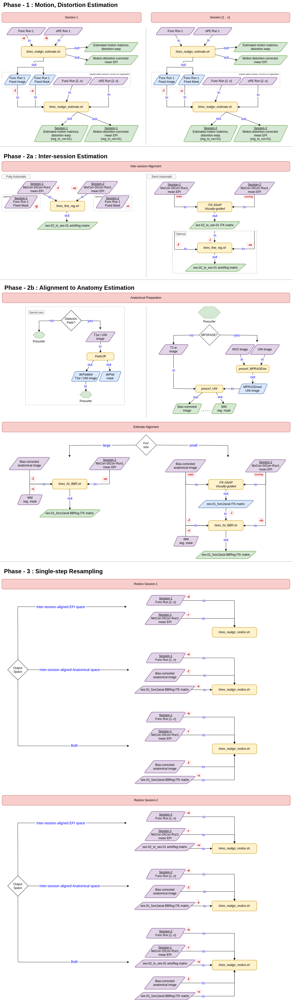

# hires-fmri-tools
A compendium of tools/scripts to process hires (laminar) fMRI data. Tested and developed on small field-of-view, sub-millimetre spatial resolution acquisitions.

## Workflow Preview

